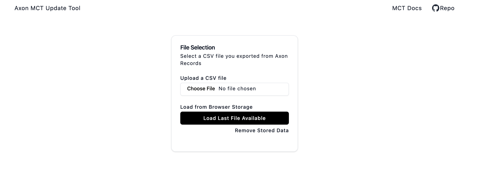
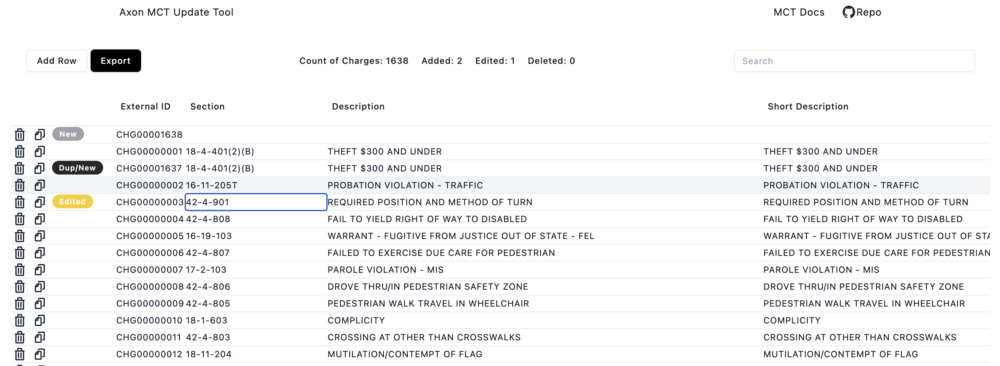

# Axon Records MCT Export Update Tool

Add and edit charges from an Axon Records MCT export file. 

>Designed to be a single HTML file that can be run locally in a web browser. 

[View the live demo](https://www.michaelzidar.com/static/demos/axon_mct/index.html)

## Basic Features

- Automatically increment the MCT External ID
- Search and filter charges by any field
- Add, edit, duplicate, and delete charges
- Export the updated MCT file
- Paste charges from Excel or Google Sheets

### Upload File View

### Edit File View
 

## How to Use

1. Download your existing MCT file from the Axon Records interface
2. Open the `index.html` file from the repo in you web browser (Edge, Chrome, Firefox, Safari, etc.)
3. Select the MCT file you downloaded from Axon Records
   1. If you already uploaded an MCT file, the tool will remember the last file you uploaded
4. Create, update, duplicate and edit, or delete charges
5. Export the updated MCT file
6. Upload the updated MCT file to Axon Records

## To-Do

- [x] When adding a charge, change the row color to indicate that the charge has been added or edited
- [ ] Add Axon data validation logic to each field
- [ ] Add column sorting
- [x] More explicit file export names
- [ ] Add dropdowns for unique values like NIBRS codes, Offense Categories, etc.
- [ ] Auto date options for the date fields (today, yesterday, max-possible, etc.)
- [x] Local Storage to retain the state even after the page refreshes
- [ ] Add check step to ensure that the MCT file is the correct format
- [ ] Add start over button to clear all changes and start fresh
  
## Known Bugs
- [ ] Inability to revert changes after paste operation